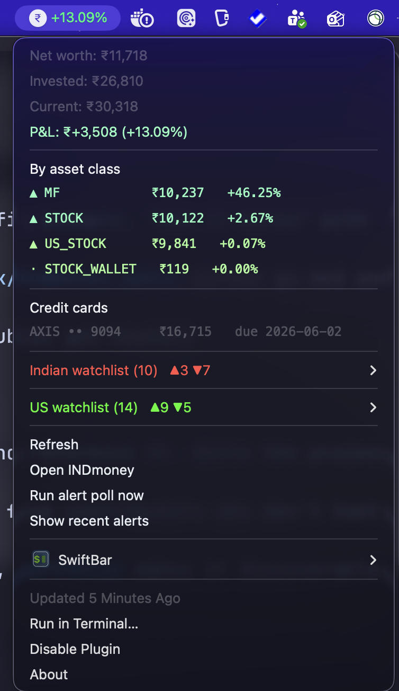
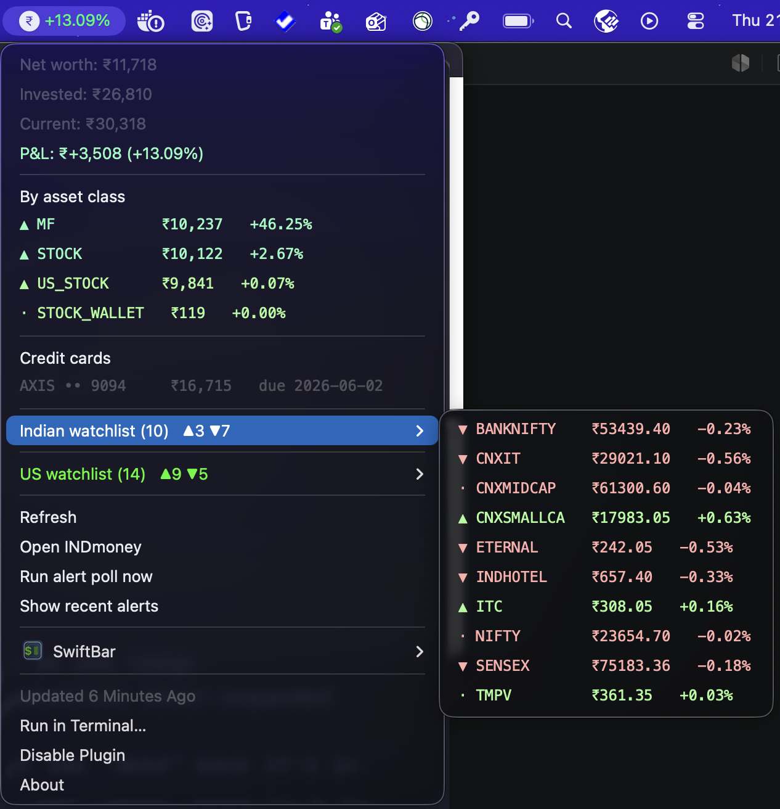

# indmoney-watch (`indw`)

A macOS CLI + menu-bar app that watches your [INDmoney](https://www.indmoney.com) portfolio, holdings, and watchlist via the official [INDmoney MCP server](https://mcp.indmoney.com), and fires native notifications when things move.

> **Status**: works on the author's account. The INDmoney MCP server is the authoritative source for tool availability — if they change schemas, this tool will need updating. PRs welcome.

<p align="center">
  
  &nbsp;&nbsp;
  
</p>

## Features

- **Portfolio alerts** — notifies on intraday total P&L swings, asset-class moves, per-holding swings (vs day and vs cost basis)
- **Watchlist alerts** — Indian + US watchlists, with user-set price targets (above/below) and intraday move thresholds
- **SIP alerts** — failed installments (sticky transition), upcoming due dates, optional success confirmations
- **Credit-card due-date warnings** — configurable lead time
- **macOS menu-bar app** — via [SwiftBar](https://github.com/swiftbar/SwiftBar): live totals, watchlist submenus with up/down tally, one-click actions
- **Background daemon** — installs as a `launchd` agent, polling Mon–Fri 09:00–16:00 IST every 10 min
- **OAuth 2.1 + PKCE + Dynamic Client Registration** — tokens stored in macOS Keychain, never in files

## Install

Requires Go 1.22+ and macOS.

```bash
git clone https://github.com/abinashstack/indmoney-watch
cd indmoney-watch
go build -o ~/bin/indw ./cmd/indw
indw login
```

The login flow opens a browser, completes OAuth against `mcp.indmoney.com`, and stashes tokens in your Keychain (service: `indmoney-watch`).

### Optional: SwiftBar menu bar app

```bash
brew install --cask swiftbar
indw menubar install   # drops a plugin script into SwiftBar's plugins dir
```

The plugin refreshes every 10 minutes by default (configurable via `menubar.refresh_interval` in config). It shows total P&L %, with a dropdown containing networth, asset-class breakdown, credit cards, watchlists (collapsed into hover-expand submenus), and SIPs.

### Optional: Background alert daemon

```bash
indw start    # installs launchd agent — polls Mon–Fri 09:00–16:00 IST every 10 min
indw stop     # uninstalls
indw logs -f  # tail the agent log
```

## Commands

```
indw login [-f]                      OAuth (skips if already logged in; -f forces)
indw status                          Current portfolio snapshot
indw watchlist                       Watchlist with live prices (IND + US)
indw sips                            Stock + MF SIPs (amount, frequency, next, status)
indw set-target SYMBOL above PRICE   Add price target (fires when LTP ≥ PRICE)
indw set-target SYMBOL below PRICE   Add price target (fires when LTP ≤ PRICE)
indw clear-target SYMBOL             Remove targets for a symbol
indw run-once                        Single poll (alerts fire if thresholds hit)
indw start                           Install launchd agent
indw stop                            Uninstall launchd agent
indw config                          Print config path + contents
indw logs [-f]                       Show launchd agent log (-f to follow)
indw state                           Show last snapshot + debounce state
indw paths                           Show all on-disk locations
indw menubar                         Print SwiftBar plugin output
indw menubar install                 Install as SwiftBar plugin
```

## Configuration

Config lives at `~/.config/indmoney-watch/config.yaml`. It's auto-created with sensible defaults on first run.

```yaml
# Alert thresholds (percent)
portfolio_swing_pct: 1.0
asset_class_swing_pct: 2.0
holding_day_swing_pct: 3.0
holding_total_swing_pct: 5.0
watchlist_day_swing_pct: 3.0
credit_card_due_warning_days: 3

# SIP alerts
sip_alerts_enabled: true
sip_due_warning_days: 2
sip_executed_alerts: false # opt-in: confirm successful installments

# Price targets (set via `indw set-target`)
targets:
  RELIANCE:
    above: 3000
    below: 2500

# Don't re-fire same alert within N minutes
debounce_minutes: 120

# Menu bar appearance (all optional — sensible defaults applied)
menubar:
  refresh_interval: 10m # SwiftBar plugin refresh cadence
  sf_symbol: indianrupeesign.circle.fill
  strong_move_pct: 2.0 # |day%| ≥ this uses the bolder color tier
  # Color overrides — accept named, hex, or "light,dark" dual-tone
  # positive_color: "#00d100,#39ff14"
  # negative_color: "#ff0033,#ff3838"
```

## How it works

`indw` speaks JSON-RPC over Streamable HTTP + SSE to the INDmoney MCP server. The relevant tools it uses:

- `get_user_networth_v2` — portfolio total, asset-class breakdown, liabilities
- `holdings` — per-asset-class holdings with day/total returns
- `user_watchlist` — Indian + US watchlist symbols with `ind_key` / `ticker`
- `get_indian_stocks_details` / `get_us_stocks_details` — live LTP + day change (capped at 10 ids/call, transparently chunked)
- `indian_stocks_sips` / `mf_sips` — SIP status, amounts, next execution

Polling state lives in `~/.config/indmoney-watch/state.json` (last-seen percentages and alert-firing timestamps for debouncing). OAuth tokens live in the macOS Keychain.

## Contributing

PRs welcome. Some directions if you're looking for ideas:

- **Cross-platform notifications** — currently uses `osascript` (macOS only). A Linux/Windows backend would open this up beyond Apple-land.
- **More tools** — `lookup_ind_keys` for friendly target naming, 52-week high/low alerts, OHLC sparkline rendering in the menu bar.
- **Refactor `launchd` setup** — IST scheduling assumes the host TZ; a sleep-loop daemon mode would be more portable.
- **Tests** — currently zero. The MCP layer is a good target.

When opening a PR:

1. `go build ./...` should succeed cleanly.
2. `go vet ./...` should pass.
3. If you change MCP tool calls, mention the tool name + payload in the PR — INDmoney's contract isn't documented anywhere public, so reverse-engineered notes help.

## Caveats

- **Personal tool, not a product.** It works on my account and probably yours, but INDmoney can change MCP schemas at any time.
- **Not financial advice.** Alerts are noisy on volatile days; tune thresholds in config to your tolerance.
- **No rate limiting from this client.** Polling cadence is set by you (default 10 min during market hours). Don't be a bad citizen.

## License

MIT — see [LICENSE](LICENSE).
