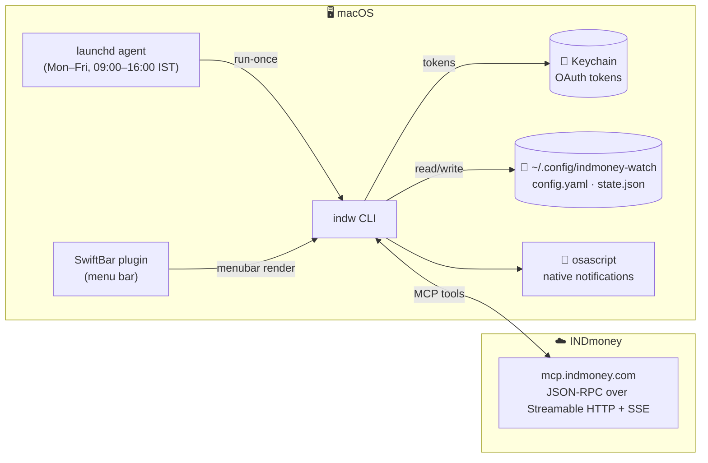

<div align="center">

# 💸 indmoney-watch &nbsp;·&nbsp; `indw`

### Your INDmoney portfolio, on the menu bar — with real-time alerts when things move.

[](https://github.com/abinashstack/indmoney-watch/actions/workflows/ci.yml)
[](https://github.com/abinashstack/indmoney-watch/actions/workflows/codeql.yml)
[](https://go.dev)
[](https://www.apple.com/macos)
[](https://modelcontextprotocol.io)
[](LICENSE)
[](https://github.com/abinashstack/indmoney-watch/commits/main)

<br/>


&nbsp;&nbsp;


<br/>

<sub>Live totals, asset-class breakdown, watchlists with hover-expand, SIPs, credit-card dues — one click away.</sub>

</div>

---

> **Status** — works on the author's account. The INDmoney MCP server is the authoritative source for tool availability; if their schemas change, this tool will need updating. PRs welcome.

## 📚 Contents

[Features](#-features) · [Quickstart](#-quickstart) · [Architecture](#-architecture) · [Commands](#-commands) · [Configuration](#-configuration) · [How it works](#-how-it-works) · [Contributing](#-contributing) · [Caveats](#-caveats) · [Star history](#-star-history) · [License](#-license)

## ✨ Features

| | |
|---|---|
| 📈 **Portfolio alerts** | Intraday total P&L swings, asset-class moves, per-holding swings (vs day **and** vs cost basis) |
| 👀 **Watchlist alerts** | Indian + US watchlists, user-set price targets (above/below), intraday move thresholds |
| 🪙 **SIP alerts** | Failed installments (sticky transition), upcoming due dates, optional success confirmations |
| 💳 **Credit-card warnings** | Configurable lead time before due dates |
| 🍎 **macOS menu bar** | [SwiftBar](https://github.com/swiftbar/SwiftBar) plugin: live totals, watchlist hover-submenus, one-click actions |
| ⏰ **Background daemon** | `launchd` agent polling Mon–Fri 09:00–16:00 IST, every 10 min by default |
| 🔐 **OAuth 2.1 + PKCE + DCR** | Tokens in macOS Keychain — never on disk |

## 🚀 Quickstart

> Requires **Go 1.22+** and **macOS**.

```bash
git clone https://github.com/abinashstack/indmoney-watch
cd indmoney-watch
go build -o ~/bin/indw ./cmd/indw
indw login
```

`indw login` opens a browser, completes OAuth against `mcp.indmoney.com`, and stashes tokens in your Keychain (service: `indmoney-watch`).

<details>
<summary><b>🍎 Add the menu-bar app (SwiftBar)</b></summary>

```bash
brew install --cask swiftbar
indw menubar install   # drops a plugin script into SwiftBar's plugins dir
```

The plugin refreshes every 10 minutes by default (configurable via `menubar.refresh_interval`). It shows total P&L %, with a dropdown containing networth, asset-class breakdown, credit cards, watchlists (hover-expand submenus), and SIPs.

</details>

<details>
<summary><b>⏰ Run the background alert daemon</b></summary>

```bash
indw start    # installs launchd agent — polls Mon–Fri 09:00–16:00 IST every 10 min
indw stop     # uninstalls
indw logs -f  # tail the agent log
```

</details>

## 🏗 Architecture



## 🧰 Commands

| Command | What it does |
|---|---|
| `indw login [-f]` | OAuth (skips if already logged in; `-f` forces) |
| `indw status` | Current portfolio snapshot |
| `indw watchlist` | Watchlist with live prices (IND + US) |
| `indw sips` | Stock + MF SIPs (amount, frequency, next, status) |
| `indw set-target SYMBOL above PRICE` | Add price target (fires when LTP ≥ PRICE) |
| `indw set-target SYMBOL below PRICE` | Add price target (fires when LTP ≤ PRICE) |
| `indw clear-target SYMBOL` | Remove targets for a symbol |
| `indw run-once` | Single poll (alerts fire if thresholds hit) |
| `indw start` / `indw stop` | Install / uninstall the launchd agent |
| `indw logs [-f]` | Show launchd agent log (`-f` to follow) |
| `indw config` | Print config path + contents |
| `indw state` | Show last snapshot + debounce state |
| `indw paths` | Show all on-disk locations |
| `indw menubar` | Print SwiftBar plugin output |
| `indw menubar install` | Install as SwiftBar plugin |

## ⚙️ Configuration

Config lives at `~/.config/indmoney-watch/config.yaml`. It's auto-created with sensible defaults on first run.

```yaml
# Alert thresholds (percent)
portfolio_swing_pct: 1.0
asset_class_swing_pct: 2.0
holding_day_swing_pct: 3.0
holding_total_swing_pct: 5.0
watchlist_day_swing_pct: 3.0
credit_card_due_warning_days: 3

# SIP alerts
sip_alerts_enabled: true
sip_due_warning_days: 2
sip_executed_alerts: false  # opt-in: confirm successful installments

# Price targets (set via `indw set-target`)
targets:
  RELIANCE:
    above: 3000
    below: 2500

# Don't re-fire same alert within N minutes
debounce_minutes: 120

# Menu bar appearance (all optional — sensible defaults applied)
menubar:
  refresh_interval: 10m            # SwiftBar plugin refresh cadence
  sf_symbol: indianrupeesign.circle.fill
  strong_move_pct: 2.0             # |day%| ≥ this uses the bolder color tier
  # Color overrides — accept named, hex, or "light,dark" dual-tone
  # positive_color: "#00d100,#39ff14"
  # negative_color: "#ff0033,#ff3838"
```

## 🔬 How it works

`indw` speaks JSON-RPC over Streamable HTTP + SSE to the INDmoney MCP server. The relevant tools it uses:

| MCP tool | Purpose |
|---|---|
| `get_user_networth_v2` | Portfolio total, asset-class breakdown, liabilities |
| `holdings` | Per-asset-class holdings with day/total returns |
| `user_watchlist` | Indian + US watchlist symbols (`ind_key` / `ticker`) |
| `get_indian_stocks_details` / `get_us_stocks_details` | Live LTP + day change (capped at 10 ids/call, transparently chunked) |
| `indian_stocks_sips` / `mf_sips` | SIP status, amounts, next execution |

Polling state lives in `~/.config/indmoney-watch/state.json` (last-seen percentages and alert-firing timestamps for debouncing). OAuth tokens live in the macOS Keychain.

## 🤝 Contributing

PRs welcome. Some directions if you're looking for ideas:

- 🌐 **Cross-platform notifications** — currently uses `osascript` (macOS only). A Linux/Windows backend would open this up beyond Apple-land.
- 🔧 **More tools** — `lookup_ind_keys` for friendly target naming, 52-week high/low alerts, OHLC sparkline rendering in the menu bar.
- ♻️ **Refactor `launchd` setup** — IST scheduling assumes the host TZ; a sleep-loop daemon mode would be more portable.
- ✅ **Tests** — currently zero. The MCP layer is a good target.

When opening a PR:

1. `go build ./...` should succeed cleanly.
2. `go vet ./...` should pass.
3. If you change MCP tool calls, mention the tool name + payload in the PR — INDmoney's contract isn't documented anywhere public, so reverse-engineered notes help.

## ⚠️ Caveats

- **Personal tool, not a product.** It works on my account and probably yours, but INDmoney can change MCP schemas at any time.
- **Not financial advice.** Alerts are noisy on volatile days; tune thresholds in config to your tolerance.
- **No rate limiting from this client.** Polling cadence is set by you (default 10 min during market hours). Don't be a bad citizen.

## ⭐ Star history

<a href="https://star-history.com/#abinashstack/indmoney-watch&Date">
  <picture>
    <source media="(prefers-color-scheme: dark)" srcset="https://api.star-history.com/svg?repos=abinashstack/indmoney-watch&type=Date&theme=dark" />
    <source media="(prefers-color-scheme: light)" srcset="https://api.star-history.com/svg?repos=abinashstack/indmoney-watch&type=Date" />
    
  </picture>
</a>

## 📄 License

MIT — see [LICENSE](LICENSE).
